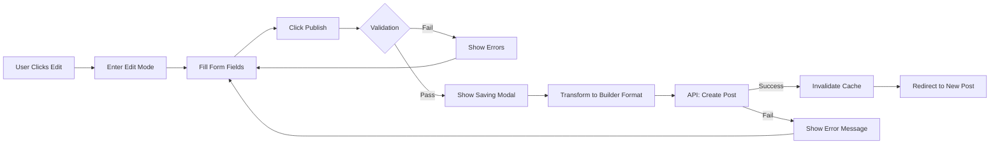
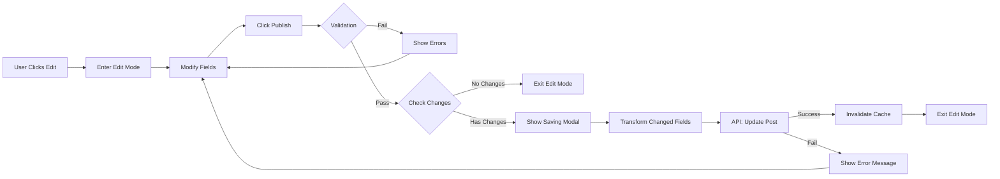

# Data Model: Post-Page Creation Migration

**Feature**: 003-post-page-migration  
**Date**: 2025-12-01  
**Status**: Phase 1 Complete

## Overview

This document defines the data entities and transformations for post-page creation and editing functionality. The model maintains compatibility with existing component interfaces while adapting to Builder.io's structure.

---

## Core Entities

### 1. Post Page

**Description**: Primary content entity representing posts, events, or project results.

**Storage**: Builder.io model `post-page`

**Fields**:

| Field Name    | Type   | Required   | Description                           | Validation              |
| ------------- | ------ | ---------- | ------------------------------------- | ----------------------- |
| `id`          | string | Yes (auto) | Builder.io unique identifier          | Generated by Builder.io |
| `name`        | string | Yes        | Human-readable name for Builder.io UI | Same as title or slug   |
| `published`   | string | Yes        | Publication status                    | Always "published"      |
| `data`        | object | Yes        | Post content and metadata             | See data fields below   |
| `createdDate` | number | Yes (auto) | Unix timestamp (milliseconds)         | Generated by Builder.io |
| `lastUpdated` | number | Yes (auto) | Unix timestamp (milliseconds)         | Updated by Builder.io   |

### 2. Post Data Fields (within `data` object)

#### Basic Content Fields

| Field      | Type   | Required | Description                    | Component Property  |
| ---------- | ------ | -------- | ------------------------------ | ------------------- |
| `title`    | string | Yes      | Post title                     | `postData.title`    |
| `subtitle` | string | No       | Post subtitle                  | `postData.subtitle` |
| `slug`     | string | Yes      | URL slug (unique)              | `postData.slug`     |
| `wixId`    | string | No       | Original Wix ID (for tracking) | `post.data._id`     |

#### Content Sections (Rich Text)

| Field               | Type          | Required | Description        |
| ------------------- | ------------- | -------- | ------------------ |
| `postContentRIch1`  | string (HTML) | No       | Content section 1  |
| `postContentRIch2`  | string (HTML) | No       | Content section 2  |
| `postContentRIch3`  | string (HTML) | No       | Content section 3  |
| `postContentRIch4`  | string (HTML) | No       | Content section 4  |
| `postContentRIch5`  | string (HTML) | No       | Content section 5  |
| `postContentRIch6`  | string (HTML) | No       | Content section 6  |
| `postContentRIch7`  | string (HTML) | No       | Content section 7  |
| `postContentRIch8`  | string (HTML) | No       | Content section 8  |
| `postContentRIch9`  | string (HTML) | No       | Content section 9  |
| `postContentRIch10` | string (HTML) | No       | Content section 10 |

#### Image Fields

| Field         | Type        | Required | Description |
| ------------- | ----------- | -------- | ----------- |
| `postImage1`  | ImageObject | No       | Image 1     |
| `postImage2`  | ImageObject | No       | Image 2     |
| `postImage3`  | ImageObject | No       | Image 3     |
| `postImage4`  | ImageObject | No       | Image 4     |
| `postImage5`  | ImageObject | No       | Image 5     |
| `postImage6`  | ImageObject | No       | Image 6     |
| `postImage7`  | ImageObject | No       | Image 7     |
| `postImage8`  | ImageObject | No       | Image 8     |
| `postImage9`  | ImageObject | No       | Image 9     |
| `postImage10` | ImageObject | No       | Image 10    |

**ImageObject Structure**:

```typescript
{
  url: string;           // Image URL
  displayName?: string;  // Optional display name
}
```

#### Reference Fields (Arrays)

All reference fields use Builder.io Reference format.

| Field           | Type        | Description                   | Related Model        |
| --------------- | ----------- | ----------------------------- | -------------------- |
| `author`        | Reference[] | Post authors                  | `tag` (person)       |
| `pageOwner`     | Reference[] | Page owners (edit permission) | `tag` (person)       |
| `people`        | Reference[] | Related people tags           | `tag` (person)       |
| `methods`       | Reference[] | Foresight methods             | `tag` (method)       |
| `domains`       | Reference[] | Domain tags                   | `tag` (domain)       |
| `projects`      | Reference[] | Related projects              | `tag` (project)      |
| `organisations` | Reference[] | Related organisations         | `tag` (organisation) |
| `pageTypes`     | Reference[] | Page type classification      | `tag` (page type)    |
| `internalLinks` | Reference[] | Internal post links           | `post-page`          |

**Reference Format**:

```typescript
{
  "@type": "@builder.io/core:Reference",
  "id": string,        // Builder.io content ID
  "model": string      // e.g., "tag" or "post-page"
}
```

#### Single Reference Fields

| Field        | Type      | Description | Related Model   |
| ------------ | --------- | ----------- | --------------- |
| `countryTag` | Reference | Country tag | `tag` (country) |

#### Event-Specific Fields

| Field               | Type        | Required | Description                   |
| ------------------- | ----------- | -------- | ----------------------------- |
| `speakers`          | Reference[] | No       | Event speakers                |
| `moderators`        | Reference[] | No       | Event moderators              |
| `eventStartDate`    | number      | No       | Unix timestamp (milliseconds) |
| `eventEndDate`      | number      | No       | Unix timestamp (milliseconds) |
| `eventRegistration` | string      | No       | Registration link URL         |

#### Project Result-Specific Fields

| Field                          | Type        | Required | Description                                           |
| ------------------------------ | ----------- | -------- | ----------------------------------------------------- |
| `projectResultAuthor`          | Reference[] | No       | Project result authors (separate from general author) |
| `projectResultMedia`           | MediaObject | No       | Main project media file                               |
| `projectResultPublicationDate` | number      | No       | Unix timestamp (milliseconds)                         |

**MediaObject Structure**:

```typescript
{
  url: string;           // File URL
  displayName: string;   // File name
  thumbnail?: string;    // Optional thumbnail URL
}
```

#### Additional Fields

| Field             | Type          | Description            |
| ----------------- | ------------- | ---------------------- |
| `mediaFiles`      | MediaObject[] | Additional media files |
| `recommendations` | number        | Recommendation count   |

---

## Data Transformations

### Component State → Builder.io API Payload

**Purpose**: Transform PostPageComponent state to Builder.io Write API format.

**Function**: `transformPostDataForBuilder(postData)`

**Input** (Component State):

```typescript
{
  title: string;
  subtitle: string;
  slug: string;
  contentText: string[];      // Array of 10 rich text sections
  contentImages: ImageObject[]; // Array of 10 image objects
  authors: TagProps[];
  pageOwner: TagProps[];
  people: TagProps[];
  foreSightMethods: TagProps[];
  domains: TagProps[];
  project: TagProps[];
  organisation: TagProps[];
  pageType: TagProps[];
  countryTag: TagProps;
  // ... event/project result fields
}
```

**Output** (Builder.io API Payload):

```typescript
{
  data: {
    title: string;
    subtitle: string;
    slug: string;
    postContentRIch1: string;
    postContentRIch2: string;
    // ... postContentRIch3-10
    postImage1: ImageObject;
    postImage2: ImageObject;
    // ... postImage3-10
    author: Reference[];
    pageOwner: Reference[];
    people: Reference[];
    methods: Reference[];
    domains: Reference[];
    projects: Reference[];
    organisations: Reference[];
    pageTypes: Reference[];
    countryTag: Reference;
    // ... event/project result fields
  },
  published: "published"
}
```

**Transformation Rules**:

1. Map `contentText[0-9]` → `postContentRIch1-10`
2. Map `contentImages[0-9]` → `postImage1-10`
3. Convert tag arrays to Reference arrays using `transformReferencesForBuilder()`
4. Map tag field names: `foreSightMethods` → `methods`, `project` → `projects`, `organisation` → `organisations`, `pageType` → `pageTypes`
5. Convert dates to Unix timestamps (milliseconds)
6. Filter out empty/null reference arrays

### Builder.io Response → Component State

**Purpose**: Transform Builder.io data to existing component interface (backward compatibility).

**Function**: `transformBuilderPostToWixFormat(builderPost)` (existing, may need minor updates)

**Input** (Builder.io Response):

```typescript
{
  id: string;
  data: {
    title: string;
    postContentRIch1-10: string;
    postImage1-10: ImageObject;
    author: Reference[];
    // ... all fields
  },
  createdDate: number;
  lastUpdated: number;
}
```

**Output** (Component Format - maintains Wix structure):

```typescript
{
  _id: string;
  dataCollectionId: "PostPages";
  data: {
    title: string;
    subtitle: string;
    slug: string;
    postContentRIch1-10: string;
    postImage1-10: ImageObject;
    author: TagProps[];  // Enriched references
    // ... all fields enriched
  },
  // ... metadata
}
```

---

## State Transitions

### New Post Creation Flow



### Existing Post Update Flow



---

## Validation Rules

### Required Field Validation

| Field   | Rule              | Error Message                         |
| ------- | ----------------- | ------------------------------------- |
| `title` | Non-empty string  | "Title is required"                   |
| `slug`  | Non-empty, unique | "Slug is required and must be unique" |

### Field-Specific Validation

| Field               | Rule                              | Error Message                              |
| ------------------- | --------------------------------- | ------------------------------------------ |
| `eventStartDate`    | Valid timestamp, < eventEndDate   | "Event start date must be before end date" |
| `eventEndDate`      | Valid timestamp, > eventStartDate | "Event end date must be after start date"  |
| `eventRegistration` | Valid URL format                  | "Registration link must be a valid URL"    |
| Reference arrays    | All IDs exist in Builder.io       | "Invalid reference: {tagName}"             |

### Pre-Save Validation

```typescript
interface ValidationState {
  title: string; // Error message or empty string
  subtitle: string; // Error message or empty string
  // ... other fields
}

function validatePostData(postData: PostData): ValidationState {
  const errors: ValidationState = {
    title: "",
    subtitle: "",
  };

  if (!postData.title || postData.title.trim() === "") {
    errors.title = "Title is required";
  }

  // Additional validation rules...

  return errors;
}
```

---

## Data Integrity

### Uniqueness Constraints

- **Slug**: Must be unique across all post pages
  - Ensured by: `sanitizeTitleForSlug()` + `generateUniqueHash()`

### Referential Integrity

- **Reference Fields**: All referenced IDs must exist in Builder.io
  - Handled by: Builder.io validates references on save
  - Fallback: Filter invalid references before API call

### Data Preservation

- **Edit State**: Preserved in component state on API failure
- **No Data Loss**: User can retry or discard changes
- **Manual Retry**: No automatic retries that could lose changes

---

## Performance Considerations

### API Call Optimization

- **Create**: 1 API call (all fields in single request)
- **Update**: 1 API call (only changed fields)
- **No Separate Reference Calls**: All references in main payload

### Change Detection (for updates)

```typescript
function detectChangedFields(
  current: PostData,
  original: PostData
): Partial<PostData> {
  const changes: Partial<PostData> = {};

  // Compare scalar fields
  if (current.title !== original.title) changes.title = current.title;
  if (current.subtitle !== original.subtitle)
    changes.subtitle = current.subtitle;

  // Compare arrays
  if (
    checkIfArrayNeedsUpdateForStrings(current.contentText, original.contentText)
  ) {
    changes.contentText = current.contentText;
  }

  if (checkIfArrayNeedsUpdateForTags(current.people, original.people)) {
    changes.people = current.people;
  }

  // ... other fields

  return changes;
}
```

### Caching Strategy

- **Cache Invalidation**: After save, before redirect
- **Paths to Invalidate**: `/post/{slug}`, `/post` (listing)
- **Graceful Degradation**: Continue if invalidation fails

---

## Testing Checklist

### Data Transformation Tests

- [ ] Component state transforms correctly to Builder.io format
- [ ] All 10 content sections map correctly
- [ ] All 10 images map correctly
- [ ] Reference arrays transform correctly
- [ ] Single reference (countryTag) transforms correctly
- [ ] Event-specific fields transform correctly
- [ ] Project result-specific fields transform correctly

### Validation Tests

- [ ] Required fields are validated
- [ ] Empty title shows error
- [ ] Invalid dates show errors
- [ ] Invalid URLs show errors

### State Transition Tests

- [ ] New post creation flow completes
- [ ] Existing post update flow completes
- [ ] Validation errors prevent save
- [ ] API errors preserve edit state
- [ ] Discard changes reverts to original state

### Data Integrity Tests

- [ ] Slugs are unique
- [ ] References resolve correctly
- [ ] No data loss on API failure
- [ ] Cache invalidation occurs after save

---

## References

- Builder.io Write API: https://www.builder.io/c/docs/write-api
- Existing transformations: `app/utils/builderPostUtils.ts`
- Feature specification: `specs/003-post-page-migration/spec.md`
- Research findings: `specs/003-post-page-migration/research.md`
